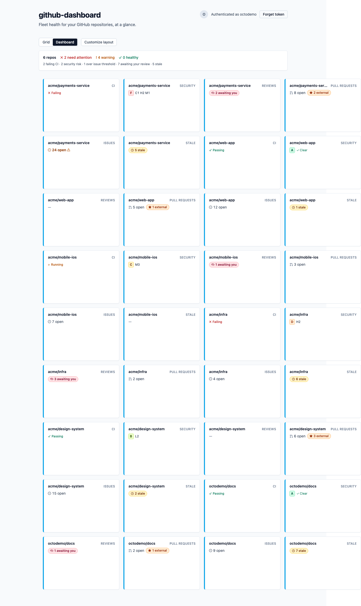

<div align="center">

# github-dashboard

**Fleet health for all your GitHub repositories — at a glance.**

### [▶ Use it now → pedrofuent.es/github-dashboard](https://pedrofuent.es/github-dashboard/)

[](https://github.com/pedrofuentes/github-dashboard/actions/workflows/ci.yml)
[](https://github.com/pedrofuentes/github-dashboard/actions/workflows/deploy.yml)
[](LICENSE)

<a href="https://pedrofuent.es/github-dashboard/">
  
</a>

<sub><i>The screenshots in this README are rendered against <b>mocked</b> GitHub data — none of these repositories are real.</i></sub>

</div>

---

If you maintain a lot of GitHub repositories, the things that need your attention are scattered across dozens of tabs: a red workflow here, a security alert there, a pull request waiting on _your_ review somewhere else. **github-dashboard** pulls all of it onto one screen so you can see — across your whole fleet — **what's broken, what's waiting on you, and what's risky**, without clicking through repo after repo.

It's a **private, zero-install, client-only** single-page app. Your token and your data stay in your browser; the only thing it ever talks to is GitHub.

- **Who it's for:** maintainers who juggle many repositories and want one place to triage them.
- **What it costs:** nothing — it's a static web app served from GitHub Pages.

## What it does

The home screen is a **fleet overview grid** — one row per repository — that brings six health signals together in one place:

| Signal               | What it tells you                                                                            |
| -------------------- | -------------------------------------------------------------------------------------------- |
| **CI / Actions**     | Latest workflow-run status per repo — failing and in-progress runs flagged first.            |
| **Security**         | Dependabot + code-scanning alerts rolled into an **A–F grade** with a severity breakdown.    |
| **Reviews**          | Pull requests awaiting **_your_** review (`review-requested:@me`).                            |
| **Pull requests**    | Open-PR count, with pull requests from **new outside contributors** highlighted.             |
| **Issues**           | Open-issue count, with a warning once the backlog crosses the triage threshold.              |
| **Stale**            | Open PRs/issues with no activity past the staleness threshold.                               |

Click any row to open the **drill-down drawer** — the full signal breakdown for a single repository:

<div align="center">
  
</div>

Together that's the seven at-a-glance signals from the [mission brief](MISSION.md) — the fleet overview grid plus its six per-repo columns — and the row drill-down.

## Dashboard view

Prefer a spatial layout over a table? A **Grid / Dashboard / Inbox** toggle (top-left of the overview) switches the fleet between the row-per-repo grid, an **at-a-glance Dashboard view**, and the **[Inbox](#inbox-view)**. The app **opens to the Dashboard by default**, and a **Default view** control next to the toggle lets you choose which view it opens to (persisted in your browser under `fleet:default-view`). In-session switches are not remembered — the app always reopens to your chosen default, not your last-used view.

<div align="center">
  
</div>

The Dashboard view is built for triage at a glance:

- **A pinned fleet summary** anchors the top: total repos and the split into **need attention** (failing CI, a D–F security grade, or an over-threshold issue backlog), **warning** (a C security grade, a pending review request, or stale items), and **healthy** — plus the non-zero per-signal rollups (failing CI, security risk, over-threshold issues, awaiting your review, stale). It's always there: not draggable, resizable, or removable.
- **Glanceable, purpose-built tiles** — one card per (repo, signal), each
  redesigned to use its full canvas instead of a shrunk-down table cell. Tiles
  follow a **salience model**: only the ones that need action carry colour — a
  failing or at-risk tile, and the "needs-you" Reviews tile — while healthy tiles
  stay **calm**, keeping their identity in the header icon, and a **thicker top
  accent bar** (growing on problems) reinforces the hierarchy. Every tile shares a
  common frame (accent bar, header, body, footer) wrapping a bespoke per-signal
  visual: **CI** shows an honest failing status with the most-recent run;
  **Security** leads with the worst severity over a **stacked severity bar**;
  **Pull requests** highlights new outside-contributor PRs and the oldest external
  PR's age; **Reviews** shows what's awaiting **you** and the oldest waiting age;
  **Issues** pairs open with stale; and **Stale** is age-led over an age-bucket
  bar. Encoding is always icon + text (never colour alone) and the micro-visuals
  stay legible in grayscale. A unified **states matrix** makes _loading_,
  _All clear_, and _Couldn't load_ visually distinct. Activate any tile (click or
  Enter/Space) to open the same drill-down drawer as the grid.
- **A density toggle** — switch the standard tiles between **Balanced** (the
  default) and **Glanceable** to control how much detail each tile shows; your
  choice is remembered.
- **An Activity tile** — a seventh signal, unique to the Dashboard view, that
  charts each repo's recent commit cadence: a commit **sparkline** of weekly
  totals (with the total as a hero number) that expands into a weeks × 7-day
  contribution **heatmap** at larger tile sizes. It fetches lazily, only for the
  repos shown.
- **Edit mode** — a **Customize layout** toggle (shown only in the Dashboard view) lets you rearrange and size tiles by **pointer drag + resize**, or with the keyboard via each tile's **Move / Resize** controls. Tile navigation follows the WAI-ARIA grid pattern (a single roving tab stop; ←/→/↑/↓ move focus between tiles), every keyboard change is announced via an `aria-live` region, and motion is suppressed under `prefers-reduced-motion` — WCAG 2.1 AA throughout.
- **Layout persistence** — your tile arrangement is saved to `localStorage` (debounced) and restored on the next visit, reconciled against the current fleet so added/removed repos are handled gracefully.

## Inbox view

The **Inbox** is the third view on the **Grid / Dashboard / Inbox** toggle — a single, **newest-first** list that gathers everything across your fleet that needs attention into one triage queue, instead of scattering it across per-repo rows and cells.

> An Inbox view screenshot is a tracked follow-up — to be captured against a mocked, fictional fleet (like the others above) and added here as `docs/screenshots/inbox.png`.

- **Five actionable signals, as discrete items** — failing CI runs, pull requests awaiting **your** review, new outside-contributor PRs, new security alerts, and stale PRs/issues — each a row you can open on GitHub, ordered by recency. (One PR can appear under more than one kind — for example a new contributor's PR that _also_ requests your review — because each is separately actionable.)
- **Per-device triage** — mark items read (open one, or "mark all"), **dismiss** and restore them, and spot a **"new since last visit"** highlight; an **unread badge** rides on the Inbox toggle. Your triage is saved in the browser under `fleet:inbox-triage` and is per-device, exactly like your theme and layout choices.
- **Filters** — narrow by repository, by kind, to unread-only, or reveal dismissed items; the filters compose entirely client-side.
- **No new access required** — the Inbox is a pure view over the data the dashboard **already fetches**: it adds **no new token permission, no new API request**, and **never writes back to GitHub** (your PAT stays read-only). It meets WCAG 2.1 AA in both themes, encoding every item with an icon and text — never colour alone.

## Appearance

github-dashboard ships in **light** and **dark** themes. A segmented **Theme**
control in the header — **Light · Dark · System** — switches between them; each
option carries an icon and a text label, so the choice is never conveyed by
colour alone.

> A dark-theme dashboard screenshot is a tracked follow-up — the per-signal tile
> surfaces are still being migrated onto the dark design tokens, so a capture
> would not yet be representative.

- **Three modes.** **Light** and **Dark** pin the theme; **System** follows your
  operating system's `prefers-color-scheme` and updates live as the OS switches
  between light and dark (e.g. on a day/night schedule).
- **Persisted.** Your choice is saved in your browser under `fleet:theme` and
  restored on the next visit. The default is **System**, so a first-time visitor
  sees the theme their OS already prefers.
- **No flash on load.** The saved theme is applied before the first paint, so the
  page never flashes the wrong theme while loading — and it does so without any
  inline script, staying within the app's strict `script-src 'self'` Content
  Security Policy.
- **Token-driven.** Colours are defined once as semantic design tokens (a light
  set and a dark set) chosen to meet the WCAG 2.1 AA contrast minimums, so a
  single class flip on `<html>` recolours the whole tree.

## Privacy & security

github-dashboard is **client-only**: there is no backend, and your data never touches a server anyone else controls.

- **Your token stays in your browser.** You paste a GitHub Personal Access Token once. By default it is kept **in memory only** (the _“Don't remember”_ option) and disappears when you close the tab. You can optionally choose **This session** (`sessionStorage`) or **This device** (`localStorage`); when persisted, it is stored under the key `github-dashboard.pat`. _(See [`src/lib/token-storage.ts`](src/lib/token-storage.ts) and [`src/hooks/AuthProvider.tsx`](src/hooks/AuthProvider.tsx).)_
- **GitHub origins only.** Every network request goes to a GitHub-owned origin — `api.github.com` for data, and `avatars.githubusercontent.com` / `raw.githubusercontent.com` for avatars. The fetch layer hard-refuses any non-GitHub origin. No telemetry, no analytics, no third parties.
- **Every response is validated.** GitHub API responses are parsed and checked with [Zod](https://zod.dev) before they ever reach the UI.
- **Read-only by design.** The token only needs read permissions (below); the app never writes to your repositories.

### Required token permissions

The app asks for a **fine-grained PAT** granting these **read-only** repository permissions:

- **Actions**
- **Code scanning alerts**
- **Contents**
- **Dependabot alerts**
- **Issues**
- **Metadata**
- **Pull requests**

Prefer a classic token? Grant the **`repo`** scope (it covers private repositories; `public_repo` alone limits the view to public repos).

#### Security alert access

Security grades require access to Dependabot and code-scanning alert feeds. Fine-grained PATs need **Dependabot alerts: read** and **Code scanning alerts: read**; classic PATs need the **`security_events`** scope. Without those permissions, the Security column shows **n/a**.

<div align="center">
  
</div>

## Quick start

1. **Open the app:** **[pedrofuent.es/github-dashboard](https://pedrofuent.es/github-dashboard/)**
2. **Create a token:** generate a [fine-grained PAT](https://github.com/settings/personal-access-tokens/new) with the [read-only permissions listed above](#required-token-permissions). _(A classic token with the `repo` scope also works.)_
3. **Paste it in** and choose whether to remember it — the default keeps it in memory only.
4. **Watch your fleet** populate with live signals, and click any repo for the drill-down.

No install, no sign-up, no backend.

## Run locally

Prerequisites: **Node.js 20+** and **npm**.

```bash
git clone https://github.com/pedrofuentes/github-dashboard.git
cd github-dashboard
npm ci
npm run dev   # start the Vite dev server, then open the printed localhost URL
```

### Scripts

| Script                  | What it does                                            |
| ----------------------- | ------------------------------------------------------ |
| `npm run dev`           | Start the Vite dev server.                             |
| `npm run build`         | Type-check, then build the production bundle to `dist/`. |
| `npm run preview`       | Serve the production build locally.                    |
| `npm test`              | Run unit/component tests (Vitest).                     |
| `npm run test:coverage` | Run tests with coverage (80% threshold).               |
| `npm run test:e2e`      | Run end-to-end tests (Playwright).                     |
| `npm run lint`          | ESLint (zero warnings) **and** a Prettier format check. |
| `npm run typecheck`     | Type-check with the TypeScript compiler only.          |
| `npm run typecheck:test` | Type-check the test files (`tsconfig.vitest.json`).   |
| `npm run format`        | Format the codebase with Prettier.                     |

## Tech stack

- **TypeScript 5.6** + **React 18**
- **Vite 5** for dev server and build
- **Tailwind CSS 3** for styling
- **Zod 3** for runtime validation of every API response
- **Vitest** + **Testing Library** (unit/component) and **Playwright** (end-to-end)
- **ESLint** (typescript-eslint) + **Prettier**

## Deployment

Hosted on **GitHub Pages** and deployed by the [Deploy to GitHub Pages](.github/workflows/deploy.yml) Actions workflow on every push to `main` (and via manual dispatch). The output is a static SPA with a `404.html` fallback for client-side routing, served under the Vite base path `/github-dashboard/`. Live at **[pedrofuent.es/github-dashboard](https://pedrofuent.es/github-dashboard/)**.

## Contributing

Contributions are welcome — please read **[CONTRIBUTING.md](CONTRIBUTING.md)** for the development workflow, coding standards, and the test-and-review process.

## License

[MIT](LICENSE) © 2026 Pedro Fuentes ([@pedrofuentes](https://github.com/pedrofuentes))
